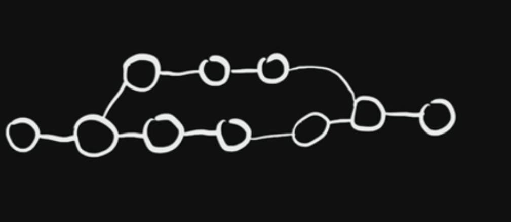

# Git & Git Hub

Date Created: 8 de julio de 2023 12:50
Status: Done 🙌

# Qué es GIT?

Es el sistema distribuido de control de versiones mas conocido del mundo.  Nos permite:

-Tener acceso al historial de un código

-Almacenar código

-Trabajar en equipo

-Identificar cuando se introdujo un error

# Configutación d

Muestra la versión

Se establece el User Name y el correo predeterminado

se establece a visual studio como editor principal

Se configuran automáticamente los saltos de línea CR y LF

Se muestran todas las opciones de configuracion de git

# Comandos básicos de BASH

ls: muestra el contenido de archivos de un determinado directorio

pwd: muestra la ubicación actual

cd carpeta de destino: Nos mueve a una carpeta objetivo

cd .. me devuelve una carpeta jerarquicamente

mk dir: crea carpeta

git init: Inicia Git

Se crea una carpeta de formato .git. Esta es invisible si se aplica el comando ls, asi que se usa ls -a para que muestre las carpetas ocultas

Si se revisa la carpeta .git, con ls -a, se veran los DETALLE DE IMPLEMENTACION. Que son los archivos necesarios para gestionar un proyecto

# Flujo de trabajo con GIT

Todos los archivos que uno genere en el computador, hay que pasarlos a una fase intermedia llamada STAGE. Los cambios que se seleccionen seran los que pasen a STAGE. Ya con los archivos y cambios adecuados, la siguiente etapa se llama COMMIT y los Commits son aquellos que se suben al servidor como GITHUB

# Agregando cambios a STAGE

UBUNTU/CursoGit/workspace/miweb

Mediante code . se abre Visualcodestudio y se crea un archivo llamado archivo1.txt y dentro del archivo se escirbe “Chanchito feliz”. Luego se escribe git status y se observará que el archivo NO ESTÁ EN STAGE porque sale en rojo

Con el comando git add archivo1.txt se agrega el archivo a la fase STAGE 

Creamos un archivo archivo2.txt con el texto chanchito triste y repetimos

Para agregar mas de un archivo a las vez git add archivo1.txt archivo2.txt

Si se modifica el archivo, asi aparece en el status

Asi que nuevamente agregamos archivo2.txt a stage y a agregarlos a COMMIT

# Commit en GIT

Habiendo agregado todos los archivo, lo pasamos a commit mediante el codigo git commit -m “Commit Inicial”. Adicional de eso revisamos estado

Podemos hacer modifcaciones en los archivos. Estas modificaciones no estarán en STAGE hasta que nosotros las agreguemos. Una vez las agreguemos, lo ideal sería bautizarlas con un nombre den el Commit. Tambien podemos eliminar archivos, es importante resaltar que lo que se guarda en STAGE no son archivos si no moficiaciones de estas

Acá muestra que se eliminó el archivo archivo2.txt y con el comando git add archivo2.txt SE AGREGA LA MODIFICACIÓN REFERENTE archivo2.txt, así esto sea una eliminación de esta. Y creramos su respectivo commit

# Renombrando archivos en GIT

# Ignorando archivos y directorios

En en editor VSCode creamos dos archivos uno llamada .ev en dodne creamos contenido así: password=123456 y en la siguiente línea user=carlos. El otro archivo se va allamar .gitignore y allí en cada línea debemos mencionar los archivos que deseamos que no se incluyan en el repositorio, allí en la primera línea .env y agregamos otro que se llamó node_modules/. Validamos que estén en el status y agregamos y nombramos el commit

# Un mejor GIT STATUS

# Visualizando Cambios

Se agrego a archivo 2.txt un chanchito feliz y a Felipe. Con el comando git diff se muestran los cambios

Con gitt diff staged podemos ver los cambios que estan en la etapa STAGED

# Viendo el Historial

# Ramas en GIT o Branches

Se puede trabajar en ramas paralela a la línea de flujo principal

con git branch vemos en que rama estamos trabajando

Con git checkout -b ramab creamos y nos pasamos a la ramab

Y hacemos modificaciones y commit en la rama b.

Ahora vamos a unor la ramab y la master mediante git merge ramab. (Validamos con git brach que estamos en la master, y aplicamos el comando git merge ramab) así nos une las ramas y bes posible que varios desarroladores trabajen sobre un mismo proyecto

# GITHUB

Acá vamos a cargar los proyectos

Copiamos y pegamos una por una las lineas mostradas

Ingresamos con usuario de Github y generamos un toquen de contraseña

Y queda cargado al github

# Modificaciones posteriores

Cada vez que se se quiera agregar mas codigo, se va al editor de codigo y se agregan los commits y se añaden a github con el comanfo git push

En el caso que se cree una nueva rama y no se haga un merge con master pero que si este en el repositorio. Se crea la nueva rama y se sube con push

